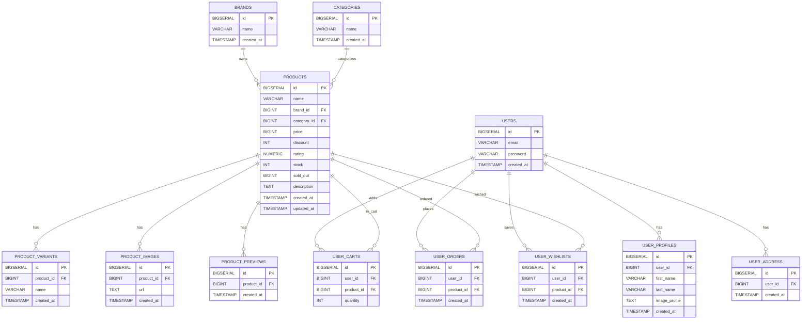

# Beli Mudah

## Entity Relationship Diagram (ERD)
The diagram below illustrates the database structure for the e-commerce application

```mermaid 

erDiagram
    %% Product Relations
    BRANDS ||--o{ PRODUCTS : owns
    CATEGORIES ||--o{ PRODUCTS : categorizes

    PRODUCTS ||--o{ PRODUCT_VARIANTS : has
    PRODUCTS ||--o{ PRODUCT_IMAGES : has
    PRODUCTS ||--o{ PRODUCT_PREVIEWS : has

    %% User Relations
    USERS ||--o{ USER_PROFILES : has
    USERS ||--o{ USER_ADDRESS : has
    USERS ||--o{ USER_CARTS : adds
    USERS ||--o{ USER_ORDERS : places
    USERS ||--o{ USER_WISHLISTS : saves

    %% Product Usage
    PRODUCTS ||--o{ USER_CARTS : in_cart
    PRODUCTS ||--o{ USER_ORDERS : ordered
    PRODUCTS ||--o{ USER_WISHLISTS : wished
    BRANDS {
        BIGSERIAL id PK
        VARCHAR name
        TIMESTAMP created_at
    }

    CATEGORIES {
        BIGSERIAL id PK
        VARCHAR name
        TIMESTAMP created_at
    }

    PRODUCTS {
        BIGSERIAL id PK
        VARCHAR name
        BIGINT brand_id FK
        BIGINT category_id FK
        BIGINT price
        INT discount
        NUMERIC rating
        INT stock
        BIGINT sold_out
        TEXT description
        TIMESTAMP created_at
        TIMESTAMP updated_at
    }

    PRODUCT_VARIANTS {
        BIGSERIAL id PK
        BIGINT product_id FK
        VARCHAR name
        TIMESTAMP created_at
    }

    PRODUCT_IMAGES {
        BIGSERIAL id PK
        BIGINT product_id FK
        TEXT url
        TIMESTAMP created_at
    }

    PRODUCT_PREVIEWS {
        BIGSERIAL id PK
        BIGINT product_id FK
        TIMESTAMP created_at
    }

    USERS {
        BIGSERIAL id PK
        VARCHAR email
        VARCHAR password
        TIMESTAMP created_at
    }

    USER_PROFILES {
        BIGSERIAL id PK
        BIGINT user_id FK
        VARCHAR first_name
        VARCHAR last_name
        TEXT image_profile
        TIMESTAMP created_at
    }

    USER_ADDRESS {
        BIGSERIAL id PK
        BIGINT user_id FK
        TIMESTAMP created_at
    }

    USER_CARTS {
        BIGSERIAL id PK
        BIGINT user_id FK
        BIGINT product_id FK
        INT quantity
    }

    USER_ORDERS {
        BIGSERIAL id PK
        BIGINT user_id FK
        BIGINT product_id FK
        TIMESTAMP created_at
    }

    USER_WISHLISTS {
        BIGSERIAL id PK
        BIGINT user_id FK
        BIGINT product_id FK
        TIMESTAMP created_at
    }
```